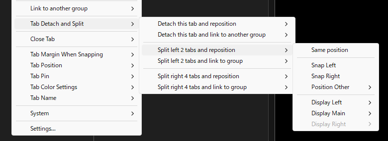
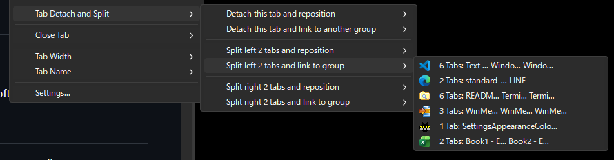

# WindowTabs

**Language:** [Japanese/日本語](README_Japanese.md)

WindowTabs is a utility that enables a tabbed interface for Windows applications that don't have one, and across different executables as well. For example, you can manage Chrome and Edge together with tabs, or manage multiple Excel or Word windows together with tabs.

This version (ss_jp_yyyy.mm.dd) is forked from payaneco's repository and incorporates some code implementations from leafOfTree's version. Maintained by [Satoshi Yamamoto (@standard-software)](https://github.com/standard-software). See [Project History](#Project-History) for the full lineage.

## Index
- [Version](#Version)
- [Download](#Download)
- [Installation](#Installation)
- [Usage](#Usage)
- [Features](#Features)
- [Settings](#Settings)
- [Building from Source](#Building-from-Source)
- [Links](#Links)
- [Project History](#Project-History)
- [License](#License)
- [Comments](#Comments)

## Version

Latest version: **ss_jp_2026.05.01**

See [version.md](version.md) for details.

## Download

**Supported OS:** Windows 10, Windows 11

Download the installer or the zip containing the exe from the [releases](https://github.com/standard-software/WindowTabs/releases) page.

- **WtSetup.msi** - Windows Installer package with automatic installation and uninstallation support
- **WindowTabs.zip** - Portable version that can be extracted and run from any location

## Installation

### Using the MSI Installer (WtSetup.msi)

1. Download `WtSetup.msi` from the [Releases](https://github.com/standard-software/WindowTabs/releases) page
2. Run the installer and follow the installation wizard
3. Choose the installation directory (default: Program Files\WindowTabs)
4. Desktop shortcut and Start Menu shortcut will be created automatically
5. Optionally launch WindowTabs at the end of installation

### Using the Portable Version (WindowTabs.zip)

1. Download `WindowTabs.zip` from the [Releases](https://github.com/standard-software/WindowTabs/releases) page
2. Extract the archive to your preferred location
3. Run `WindowTabs.exe`

## Usage

- Launch `WindowTabs.exe`.
- Right-click the tray icon to access settings.
- In the [Programs] tab of settings, choose programs you want tabs for.
- Tabs will appear on those programs' windows.
- Right-click on tabs to access tab-specific options.
- Drag and drop tabs to combine them into tab groups.

## Features

### Tab Drag and Drop
- Drag tabs to reorder within the same group
- Drag tabs to split into a new window or link to another group

### Tab Management

- **Tab Context Menu**
  - New launch : execute (exe name)
    - New tab : right of this tab ((exe name))
    - New window (position) (same submenu as "Position Move", with a leading "Same position" item)
    - New window (link to group)
  - Position Move
    - Snap Left
    - Snap Right
    - Snap Other
      - Snap Top
      - Snap Bottom
      - Snap 90%
        - Left / Right / Top / Bottom
        - Top Left / Top Right / Bottom Left / Bottom Right
        - Center / Center Horizontally / Center Vertically
      - Snap 70% / 50% / 30% (same items as Snap 90%)
      - Snap Display
      - Snap Desktop
    - Move
      - Left Edge / Right Edge / Top Edge / Bottom Edge
      - Top Left / Top Right / Bottom Left / Bottom Right
    - (per-display submenus, with leading "Same position on this display")
  - Link to another group
  - Tab Detach and Split
    - Detach this tab and reposition (same submenu as "Position Move")
    - Link to another group
    - Split left {N} tabs and reposition
    - Split left {N} tabs and link to group
    - Split right {N} tabs and reposition
    - Split right {N} tabs and link to group
  - Close Tab
    - Close tab : (tab name)
    - Close {N} tabs to the left
    - Close {N} tabs to the right
    - Close other tabs
    - Close all tabs
  - Tab Margin When Snapping
    - Add margin at top
  - Tab Position
    - Align all tabs to Left
    - Align all tabs to Right
    - Individual Tab Alignment
      - Align this tab to Left|Right : (tab name)
      - Align {N} left tab(s) to Left|Right
      - Align {N} right tab(s) to Left|Right
  - Tab Pin
    - Pin this tab : (tab name)
    - Unpin this tab : (tab name)
    - Pin {N} left tab(s)
    - Unpin {N} left tab(s)
    - Pin {N} right tab(s)
    - Unpin {N} right tab(s)
  - Tab Color Settings
    - This tab color : (tab name)
      - Red / Blue / Green / Yellow / Purple / Orange / Pink
      - (same 7 colors, Underline variants)
      - (same 7 colors, Border variants)
    - Clear this tab color
    - Left {N} tab(s) color (same color choices)
    - Clear left {N} tab(s) color
    - Right {N} tab(s) color (same color choices)
    - Clear right {N} tab(s) color
  - Tab Name
    - Rename tab
    - Reset tab name
  - System
    - Copy (exe name) path
    - Copy window title : (window title)
    - Open folder of (exe name)
    - Force kill this process
  - Settings...

### New Launch

- Launch a new instance of the same exe as the target tab.
- You can launch as a new tab to the right of the target, as a new standalone window, or linked to another tab group.

### Position Move

- Move a tab group's position.
- Snap keeps the current width / height and snaps to a screen edge. Snap Left and Snap Right are commonly used so they sit at the top of the menu for quick access.
- Snap with a percentage resizes the width / height to the specified portion of the display and snaps to an edge.
- Move to a display edge or corner, and snap-to-display / snap-to-desktop maximize-style options are also available.

### Link to another tab group

- Move all tabs of the current tab group into another existing tab group.
- Other tab groups can be distinguished by their leading tab icon, tab name, and tab count.

### Detach this tab / Split right/left side

- Detach the selected tab, or split tabs to the right or left from the selected tab, and reposition them.
- They can also be linked to another tab group.

### Close Tab

- Close the selected tab, the tabs to its left or right, the other tabs in the group, or all tabs.

### Per-Tab Alignment

- Each tab can be individually set to left- or right-aligned within a tab group.
- The "align all tabs to left / right" menu items are placed first for quick batch alignment.

### Pinned Tabs

- A pinned tab can be displayed as an icon-only tab.
- It can also be configured with a specified width and show a pin button.
- Pinned tabs are placed leftmost within their (left- or right-aligned) group.
- The selected tab, or the left-side / right-side tabs, can be pinned together.

### Tab Color

- Apply a color to the selected tab, or to all left-side / right-side tabs.
- Choose between background fill, underline, or border color types.

### Dark Mode / Light Mode

- The tab / tray-icon context menus (popup menus) and the settings dialog can be switched to dark mode.

### Multi-Display and DPI Support

- Multi-display support with proper window positioning
- DPI-aware window placement
- Automatic window resizing when dropped to prevent exceeding monitor dimensions

### Virtual Desktop Support

- Tab groups are preserved when switching virtual desktops (Win+Tab)
- Tab group state is restored across all virtual desktops on WindowTabs restart

### UWP Application Support

- Supports UWP (Universal Windows Platform) applications
- All UWP apps are collectively treated as a single exe, supporting tabbing and auto-grouping
- Properly detects the state of apps on other virtual desktops

### Multi-Language Support

- English, Japanese, Chinese Simplified, and Chinese Traditional language support
- Japanese Kansai and Tohoku dialect files included
- Any language can be supported by adding a language file
- Runtime language switching without restart
- Switch languages via tray menu

### Disable Feature

- All tab functionality can be temporarily disabled without quitting WindowTabs.
- Useful when using an app in full-screen mode.

### Tab Group Persistence

- WindowTabs preserves your tab group configuration across restarts and when disabled.

### Watchdog Auto-Restart

- WindowTabs may occasionally freeze in the following situations; in those cases the watchdog mechanism detects the unresponsive state and automatically restarts the application.
  - Switching monitors
  - Waking from sleep or hibernate
  - Changing Windows display settings
- Tab group configuration is preserved and restored on restart.

## Settings

Access settings by right-clicking the tray icon and selecting "Settings" or by right-clicking on a tab and selecting "Settings...".

### Programs Tab

Configure programs to use tabs and auto-grouping.

- **Tabs**: Enable/disable tabbing for each program
- **Auto Grouping**: When enabled, windows of the same program are automatically grouped into the same tab group
- **Category 1-10**: Assign programs to a category for cross-application auto-grouping
  - Programs in the same category are automatically grouped together regardless of the executable
  - For example, assign Word, Excel, PowerPoint, etc. to the same category to auto-group Office apps together
  - Category columns are only visible when Auto Grouping is enabled for a program
- **Show all settings**: Checkbox to display settings for programs not currently running
- **Delete button [x]**: Remove settings for non-running processes

### Appearance Tab

- Customize the visual appearance of tabs.
- Custom color theme features
  - If you create a nice color theme, please share it at [GitHub Issues](https://github.com/standard-software/WindowTabs/issues). Your theme may be included as a preset theme.

### Behavior Tab

- Configure tab behavior.

### Workspace Tab

- Save the layout of currently displayed tab groups and restore it later.

## Building from Source

### Prerequisites

- Visual Studio 2026 Community Edition
- WiX Toolset v3.11 or newer (for building the MSI installer)

### Build Scripts

A build script is provided in the project root:

- **build_release.bat** - Builds both the MSI installer and the portable ZIP distribution
  - Output: `exe\installer\WtSetup.msi`
  - Output: `exe\zip\WindowTabs.zip`

Simply run the batch file to create the distribution packages.

## Links

### English Resources

- WindowTabs - Download
  https://www.softpedia.com/get/Desktop-Enhancements/ssWindowTabs.shtml

### Japanese Resources

- WindowTabs のダウンロード・使い方 - フリーソフト100  
  https://freesoft-100.com/review/windowtabs.html

- どんなウィンドウもタブにまとめられる「WindowTabs」に日本語派生プロジェクトが誕生（窓の杜） - Yahoo!ニュース  
  https://news.yahoo.co.jp/articles/523e4c5b9db424bb1edfc582d647c1624a9b7502 (404 Not Found)

- どんなウィンドウもタブにまとめられる「WindowTabs」に日本語派生プロジェクトが誕生 - 窓の杜  
  https://forest.watch.impress.co.jp/docs/news/2067165.html

- WindowTabs のダウンロードと使い方 - ｋ本的に無料ソフト・フリーソフト  
  https://www.gigafree.net/utility/window/WindowTabs.html

- C# - WindowTabs というオープンソースを改良してみたいのですがビルドができません。何か必要なものがありますか？ - スタック・オーバーフロー  
  https://ja.stackoverflow.com/questions/53770/windowtabs-というオープンソースを改良してみたいのですがビルドができません-何か必要なものがありますか

- 全Windowタブ化。Setsで頓挫した夢の操作性をオープンソースのWindowTabsで再現する。 #Windows - Qiita  
  https://qiita.com/standard-software/items/dd25270fa3895365fced

## Project History

It was originally developed by Maurice Flanagan in 2009 and was provided back then as both free and paid versions. The author has now open-sourced the utility.

- https://github.com/mauricef/WindowTabs (404 Not Found)

Mr./Ms. redgis forked it and migrated to VS2017 / .NET 4.0.

- https://github.com/redgis/WindowTabs

Mr./Ms. medlir hosts the source code.
- https://github.com/medlir/WindowTabs

Looking at the commit log, Mossy Flanagan made the early commits.
- https://github.com/mossy-xyz

Mr./Ms. payaneco forked medlir/WindowTabs's source code.
- https://github.com/payaneco/WindowTabs
- https://github.com/payaneco/WindowTabs/network/members
- https://ja.stackoverflow.com/a/53822

Mr./Ms. leafOfTree also created a fork with various improvements:
- https://github.com/leafOfTree/WindowTabs
- https://github.com/leafOfTree/WindowTabs/network/members

## License

This project is open source and licensed under the MIT License.

## Comments

If you have any issues, please contact us via GitHub Issues or email: `standard.software.net@gmail.com`

