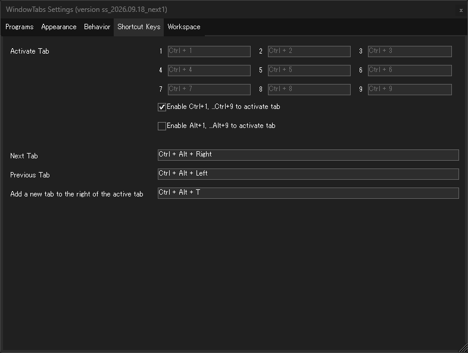

# WindowTabs

**Language:** [English](README.md)


WindowTabs は、あらゆるウィンドウをタブユーザーインターフェース(UI)で管理することができる Windows の操作性を拡張するツールです。

<details>
<summary>WindowTabs の説明をもっと見る</summary>

### WindowTabs で Windows の操作性を大きく高めていただきたいです。

WindowTabs は Windows の操作性を大きく高めるツールです。

スマートフォンやタブレット端末でブラウザ閲覧やエンターテイメントを楽しめる時代に、みなさんは、Windows PC を使っているということは、それは何か創造的な作業をされているんだと思います。例えば、経理、お客様対応、プレゼン作成、経営管理、法的事務、医療業務の電子カルテ操作、動画編集、イラスト作成、あるいはソフトウェア開発、など。

そのような作業を日々行っていて Windows の操作性を向上させたいと思っている方にこそ、WindowTabsを使って操作性を作業効率を高めていただきたいと思っています。そのようなニーズに応えられるような機能を作りこんでバージョンを重ねてきました。

### なぜタブUIなのか

ブラウザを日々使っていると感じるように、タブUIは非常に直感的で人間に心地のよいUIです。

WindowTabs を導入することでブラウザと同様の操作性を Windows にもたらします。使っていただけると、とても便利です。てきぱきと仕事をこなすために重要な操作性と感じられると思います。目的の作業を行うためにウィンドウをいろいろ切り替えると思いますが、その際の操作コストが下がり目的に集中することができます。

### 以前に Microsoft が試作していましたが頓挫しました。

Microsoft も、以前に Windows の OS の機能拡張の試作として Sets という機能で、ウィンドウの全てをタブ管理することを目指していたことがありました。
ですが、中止になっています。正確な理由はわかりませんので推測ですが、OS の内部に組み込むには過去の互換性などで難しすぎ、複雑さのわりにメリットが薄いと判断された、というところでしょう。

頓挫してしまいましたが、その目指す方向は素晴らしかったと思います。
実際に、WindowTabsを日常で使っていると、きわめて快適にウィンドウ切り替え操作ができて作業効率があがるからです。
WindowTabs は、OS の内部には組み込まれない形で、ほとんどどのようなウィンドウでもタブ化できるという優れたタブUIを実現しています。

### ss_版の作者の私 satoshi-yamamoto について

私は WindowTabs がオープンソースになる前から WindowTabs の有料ユーザーでタブUIをとても気に入って使っていました。昔から、この操作性が多くの人に広がってくれたらうれしいなと思っていましたし、さまざまな同種のソフトウェアも試してきました。

ですので、オープンソースで WindowTabs を改良して他の方に届けることができる機会が得られたことは、とても嬉しいです。

「より多くの方へ効率よい操作性を提供するにはどうしたらいいか、言い換えると、どうすれば多くの方がより仕事を素早く完了させるようにできるだろうか」ということを考えて、WindowTabs を少しずつ改善していっています。

### 使い方

個人個人のユーザーの Windows の使い方が様々であるように、ユーザーひとりひとりに WindowTabs の便利な使い方がありそうな気はしますが、代表的には次のような使い方がありそうです。

- Chrome と Edge と Firefox、そしてそれぞれのシークレットモード/プライベートモードのウィンドウを、全て1つのブラウザウィンドウとして操作する
- 複数のExcel、複数のWordやPowerPointを1つのオフィスアプリのウィンドウとして管理する。

私(satoshi-yamamoto)はソフトウェア開発者で、普段の仕事ではWebアプリケーションを作っています。ブラウザで絵をかいたりするツールや、ブラウザで動くカーナビや、ビジネスチャットツールを作ってきました。

私は複数の VSCode、Visual Studio、Terminal、WinMerge、ファイラー、画像ビューワー、Excel、ブラウザを WindowTabs でまとめ、各ディスプレイの左右にスナップしています。タブUIを備えたアプリであっても、それをウィンドウ単位で管理できるので、タブの多段階管理を行っていて、同じプロジェクトのタブを同色にすることで、非常に多くのウィンドウを苦労なく管理することができます。

### version ss_ の強化点

WindowTabs version ss_... では、ウィンドウのタブ管理に加えて、上下左右へのスナップや別ディスプレイへの移動を1アクションで実行できます。Windows 標準のスナップ機能よりもより多くの機能を持つスナップ機能をもたせています。1アクションでドラッグ&ドロップせずにウィンドウ配置を切り替えられます。これは特にマルチディスプレイ環境で便利です。

### まわりの方にも勧めていただけたら、うれしいです

たくさんのウィンドウを切り替えて作業する方がいたら、ぜひ「WindowTabs を使ってみたら？」と勧めていただけたら嬉しいです。使って初めて分かる便利さがあります。

私は、自分が使いたいから作っているだけではあるのですが、それでも他の人の役に立てて、少しでもいい影響を届けることができれば、ソフトウェア開発者として非常にうれしいです。使ってくださっているユーザーの皆様に感謝しています。

何かご意見ありましたら、GitHub Issues に投稿いただけますとうれしいです。

</details>

<br />

私が作成しているこのバージョン (ss_yyyy.mm.dd) は payaneco 氏のリポジトリからフォークし、leafOfTree 氏のコード実装の一部が組み込まれています。メンテナンスは、[Satoshi Yamamoto (@standard-software)](https://github.com/standard-software) が行っています。

<details>
<summary>フォーク元の系譜、プロジェクトの経緯について、もっと見る</summary>

元々は Maurice Flanagan 氏によって2009年に開発され、当時は無料版と有料版が提供されていました。開発者は現在、このユーティリティをオープンソース化しています。

- https://github.com/mauricef/WindowTabs (404 Not Found)

redgis 氏がフォークし、VS2017 / .NET 4.0 に移行しました。

- https://github.com/redgis/WindowTabs

medlir 氏がコードを配置しています。
- https://github.com/medlir/WindowTabs

コミットログをみると、Mossy Flanagan 氏が初期のコミットを行っています。
- https://github.com/mossy-xyz

payaneco 氏が medlir/WindowTabs のコードをフォークしました。
- https://github.com/payaneco/WindowTabs
- https://github.com/payaneco/WindowTabs/network/members
- https://ja.stackoverflow.com/a/53822

leafOfTree 氏も様々な改良を加えたフォークを作成しています:
- https://github.com/leafOfTree/WindowTabs
- https://github.com/leafOfTree/WindowTabs/network/members

</details>

## 目次
- [バージョン](#バージョン)
- [ダウンロード](#ダウンロード)
- [インストール](#インストール)
- [使用方法](#使用方法)
- [機能](#機能)
- [設定](#設定)
- [ソースからビルド](#ソースからビルド)
- [リンク](#リンク)
- [ライセンス](#ライセンス)
- [コメント](#コメント)

## バージョン

最新のバージョン: **ss_2026.09.21**

詳細は [version_Japanese.md](version_Japanese.md) を参照してください。


## ダウンロード

**対応している OS:** Windows 10、Windows 11

<a href="https://github.com/standard-software/WindowTabs/releases"></a>

[releases](https://github.com/standard-software/WindowTabs/releases) ページからダウンロードできます。

## インストール

- **WtSetup.msi** - インストーラー版。実行してウィザードに従ってください (既定: `Program Files\WindowTabs`)
- **WindowTabs.zip** - ポータブル版。任意の場所に展開し、`WindowTabs.exe` を実行してください


## 使用方法

- トレイアイコンの右クリックで「設定」を開き、「プログラム」タブでタブ化する対象を選びます。
- タブをドラッグ&ドロップしてグループ化し、右クリックで各種操作を行います。


## 機能

### 複数タブ選択

- Ctrl + クリックで選択/選択解除、Shift + クリックでアクティブタブからの範囲選択。
- 選択中は、コンテキストメニューとドラッグ操作が選択全体を対象に動きます。

### タブのドラッグ&ドロップ
- 同じグループ内で順番を変更 (複数選択時は、連続している部分が動きます)
- 新規ウィンドウに分割、別グループに連結 (複数選択時は、選択したタブ全体が一緒に動きます)

### タブのコンテキストメニュー

```
対象タブ : (タブ名) — メニューの対象タブを示す表示専用の項目 (選択不可)
---
新しいタブ : (exe名) 起動
  このタブの右
  ---
  位置指定 (「位置移動」と同じサブメニュー)
  他のグループへ連結
---
位置移動
  左スナップ / 右スナップ / 上スナップ / 下スナップ
  ---
  スナップ 90% / 70% / 50% / 30% それぞれ
    左 / 右 / 上 / 下
    左上 / 右上 / 左下 / 右下
    中央 / 水平方向に中央 / 垂直方向に中央
  ---
  スナップ ディスプレイ全体
  スナップ デスクトップ全体 (マルチディスプレイ時のみ)
  ---
  移動
    左端 / 右端 / 上端 / 下端
    左上 / 右上 / 左下 / 右下
このタブグループを他のグループへ連結 (サブメニューで他のタブグループを列挙。連結先を選択)
---
このタブの分離
  位置指定 (「位置移動」と同じサブメニュー)
  他のグループへ連結
---
タブを閉じる
  このタブを閉じる
  ---
  左側の{N}タブを閉じる
  右側の{N}タブを閉じる
  ---
  他のタブを閉じる
  全てのタブを閉じる
---
タブグループの動作
  ウィンドウの移動と上端リサイズを禁止
  スナップ時にタブの高さ分の余白をあける
タブの配置
  全てのタブを左寄せ
  全てのタブを右寄せ
  ---
  このタブを左寄せにする
  このタブを右寄せにする
タブのピン止め
  このタブをピン止め
  このタブのピン止めを外す
  ---
  全てのタブをピン止め
  全てのタブのピン止めを外す
タブの色設定
  このタブの色を設定
    赤 / 青 / 緑 / 黄色 / 紫 / オレンジ / ピンク
    ---
    (同じ7色の下線バリエーション)
    ---
    (同じ7色の枠線バリエーション)
  このタブの色設定を解除
  ---
  全てのタブの色設定を解除
タブ名の編集
  このタブの名前を変更 : (タブ名)
  このタブの名前をリセット : (リセット後のタブ名)
---
システム
  (exe名) のパスをコピー
  ウィンドウタイトルをコピー : (タイトル)
  ---
  (exe名) のフォルダを開く
  このプロセスの強制終了
---
設定...
```

複数選択時には、個別タブ向け項目が「選択した{N}タブ...」に変わります。右クリックしたタブが選択に含まれていない場合は「選択した{N}タブ+対象タブ...」になり、「他のタブを閉じる」は「選択していない{N}タブを閉じる」になります。単独タブを基準にする項目は Disabled になります。

### 新しいタブ (新規起動)

- 同じ exe を新規起動し、そのタブの右・指定位置の新しいウィンドウ・他のタブグループに配置できます。


### 位置移動

- スナップは幅・高さを維持して画面端へ移動し、% 指定時はディスプレイに対する比率でサイズを変えます。画面端や四隅への移動、ディスプレイ・デスクトップ全体への最大化もできます。
- マルチディスプレイ時は、位置移動系のメニューがディスプレイごとに出ます (例:「位置移動 左ディスプレイ」)。現在のディスプレイには「(ここ)」が付き、他のディスプレイには「このディスプレイと同じ位置」が先頭に付きます。


### このタブグループを他のグループへ連結

- 現在のグループのタブを全て、他のタブグループに連結します。


### タブの分離

- 分離したタブを、指定の位置へ移動したり、他のタブグループに連結できます。
- まとめて分離するときは、先に [複数タブ選択](#複数タブ選択) を行ってから「選択した{N}タブの分離」を実行します。

### タブを閉じる


### タブの配置

- タブごと、または全タブ一括で左寄せ・右寄せを設定できます。
- タブをドラッグしても左寄せ右寄せを変更できます。
- 設定[左右スナップ時のタブ配置]により、左右スナップしたとき、全タブの配置が左か右かにそろっている場合には、スナップした側へ自動で寄せることもできます。

### ピン止めタブ

- ピン止めタブは、アイコンのみ、または幅を指定してピン止めボタン付きで表示できます。
- ピン止めしたタブは、左寄せや右寄せタブの中でも左側に配置されます。


### タブのカラー

- 背景・下線・枠線でタブを色分けできます。


### ダークモード / ライトモード

- タブとトレイアイコンのコンテキストメニュー、設定ダイアログをダークモードにできます。

### マルチディスプレイと高 DPI をサポート

- 拡大率の異なるディスプレイ間でも、タブ・設定画面・確認ダイアログの表示サイズが追従。125% / 150% / 175% などでも鮮明に描画し、ホバー・クリック位置も表示に一致
- ドロップ時にウィンドウがディスプレイのサイズを超えてしまう問題を防止

### 仮想デスクトップをサポート

- 仮想デスクトップ (Win+Tab) を切り替えてもタブグループを保持
- WindowTabs の再起動時に全ての仮想デスクトップのタブグループ状態を復帰
- タブグループは1つの仮想デスクトップに収まります。タスクビューでタブ化されたウィンドウを別のデスクトップへ移すと、そのウィンドウはタブグループから外れます
- 「他のグループへ連結」系のメニューには、別の仮想デスクトップにあるタブグループは表示されません

### UWP アプリをサポート

- UWP (Universal Windows Platform) アプリは全体を 1 つの exe として扱い、タブ化や自動グループ化に対応

### 多言語をサポート

- 英語、日本語、簡体と繁体の中国語、韓国語、フランス語、ドイツ語、イタリア語、スペイン語、ポルトガル語、トルコ語、ポーランド語、ベトナム語、インドネシア語をサポート。日本語の関西弁・東北弁版も同梱
- トレイメニューから、再起動なしで言語を変更可能

### 設定ファイル

- `WindowTabs.exe` と同じ場所の `Settings\` に既定値があります
    - `VersionFolder.json` — バージョンごとにフォルダが変わるアプリを同一視する設定
    - `WindowMargin.json` — ウィンドウの枠が太いアプリに対応する設定
    - `Language\FileList.json` と `Language\言語.json` — 言語ファイル
- ここのファイルはバージョンアップのたびに上書きされます。変更するときは `%APPDATA%\WindowTabs\Settings\` に同名のファイルを置いてください。項目単位で同梱のものに重なります
- 言語を追加するには、`MyLanguage.json` と、それを載せた `FileList.json` を `%APPDATA%\WindowTabs\Settings\Language` に置きます
  - 訳語を直すには、同名のファイルに直したいキーだけを書きます。他は同梱のまま使われ、新しいバージョンで増えた文字列もそのまま届きます
  - `FileList.json` は同梱の一覧を丸ごと置き換えるので、トレイメニューに出す言語を絞ることもできます

### ss_2026.09.02 以前の設定ファイルについて

- ss_2026.09.02 までは、言語ファイルは `Language\` に、余白設定は `Settings\Window_Margin.json` にあり、直接編集する仕様でした。現在のバージョンはどちらも読みません (MSI は削除し、zip では残ります)
- 編集していた場合は、バージョンアップの前に `%APPDATA%\WindowTabs\Settings\Language\` と `%APPDATA%\WindowTabs\Settings\WindowMargin.json` へ移してください

### 最新バージョンの確認

- トレイメニューの「最新バージョンの確認」から、GitHub の最新リリースを確認できます。クリックしたときだけ行われ、自動では確認しません。
- 新しいバージョンがあれば、その場で更新できます。MSI 版はインストーラーが起動し、ZIP 版は実行ファイルを置き換えて再起動します。

### 無効にする機能

- WindowTabs を終了せずに、全てのタブ機能を一時的に無効にできます。全画面でアプリを使うときなどに便利です。

### タブグループの永続化

- タブグループの構成は10秒ごとに保存され、WindowTabs の再起動・無効化・強制終了のあとも保持されます。
- Windows の再起動やログオフのあとも復元されます。ウィンドウハンドルが変わっていても、アプリとタイトルで同じウィンドウだと判断します。
- タブの名前・ピン・色・左右寄せ・グループ内の位置も、ウィンドウとともに戻ります。タイトルがまだ確定していないウィンドウ (ファイルを開く前の Excel など) は、本来のタイトルになってから自分の席に戻ります。
- 開き直されていないウィンドウの情報は30日、手で閉じたタブの情報は8日保持されます。

### Watchdog による自動再起動

- 万一 WindowTabs が無応答になった場合、Watchdog がフリーズを検出して自動的に再起動します。タブグループは保持・復元されます。
- 以前のバージョンでは、ディスプレイ構成の変更、スリープ復帰によってフリーズしていたため、この機能が重要な役割を果たしていましたが、現在は修正済みのため、保険としてのみ残っています。

## 設定

トレイアイコンの右クリック、またはタブの右クリックで「設定...」メニューを選びます。ダイアログを開いている間は、重複操作を防ぐためトレイ操作が無効になります。

### プログラムタブ

- **タブ**: プログラムごとにタブ機能の有効/無効を設定
- **自動グループ化**: 同じプログラムのウィンドウが自動で同じタブグループにまとまります
- **カテゴリー 1-10**: 同じカテゴリーのプログラムは、異なるアプリでも自動でグループ化されます。Word・Excel・PowerPoint を同じカテゴリーにすれば Office 系がまとまります (列は自動グループ化が有効なプログラムにのみ表示)
- 自動グループ化やカテゴリーを **ON にすると、すでに開いているウィンドウ**も、たったいま起動したかのようにまとめられます。設定が ON のまま手で引き剥がしたタブは、そのまま外に残ります。
- **すべての設定を表示**: 現在実行していないプログラムの設定も表示します。**[x]** でその設定を削除できます


### 表示タブ

よいカラーテーマを作成された方は、ぜひ [GitHub Issues](https://github.com/standard-software/WindowTabs/issues) に投稿してください。既定のカラーテーマとして組み込ませていただく場合もあります。


### 動作タブ

- **左右スナップ時のタブ配置**: 寄せが揃ったグループを左右スナップ (x% 含む) すると、タブをスナップ側に寄せます。「変更しない」も選択可能。
- **タブの上下方向**: 「上方向、画面外に出る場合は下方向」(既定) または「常に下方向」を選択。
- 全画面時・ウィンドウ移動時の非表示や、下方向タブを隠す方法も設定できます。
- **ウィンドウの移動と上端リサイズを禁止**: タイトルバーのドラッグでの移動と、上端からのサイズ変更を止めます。左右と下端のサイズ変更は可能です。これを変更すると全てのタブグループに反映されます。


### ショートカットキータブ

- タブ1～9の選択、前後のタブへの切り替え、新規タブ追加のキーを設定できます。数字キーは Ctrl+1～9・Alt+1～9 または個別指定で、対象ウィンドウの操作中のみ有効です。



### ワークスペースタブ

- タブグループの配置と、タブの装飾・ピン・名前・寄せを保存・復元できます。

## ソースからビルド

### 前提条件

- Visual Studio 2026 Community Edition
- WiX Toolset v3.11 またはそれ以降 (MSI インストーラー版のビルド)

### ビルドスクリプト

プロジェクトのルートの **build_release.bat** で、MSI インストーラー版とポータブル ZIP 版の両方をビルドできます。

- 出力: `exe\installer\WtSetup.msi`、`exe\zip\WindowTabs.zip`

## リンク

### 英語のリソース

- WindowTabs - Download  
  https://www.softpedia.com/get/Desktop-Enhancements/ssWindowTabs.shtml

### 日本語のリソース

- WindowTabs のダウンロード・使い方 - フリーソフト100  
  https://freesoft-100.com/review/windowtabs.html

- どんなウィンドウもタブにまとめられる「WindowTabs」に日本語派生プロジェクトが誕生（窓の杜） - Yahoo!ニュース  
  https://news.yahoo.co.jp/articles/523e4c5b9db424bb1edfc582d647c1624a9b7502 (404 Not Found)

- どんなウィンドウもタブにまとめられる「WindowTabs」に日本語派生プロジェクトが誕生 - 窓の杜  
  https://forest.watch.impress.co.jp/docs/news/2067165.html

- WindowTabs のダウンロードと使い方 - ｋ本的に無料ソフト・フリーソフト  
  https://www.gigafree.net/utility/window/WindowTabs.html

- C# - WindowTabs というオープンソースを改良してみたいのですがビルドができません。何か必要なものがありますか？ - スタック・オーバーフロー  
  https://ja.stackoverflow.com/questions/53770/windowtabs-というオープンソースを改良してみたいのですがビルドができません-何か必要なものがありますか

- 全Windowタブ化。Setsで頓挫した夢の操作性をオープンソースのWindowTabsで再現する。 #Windows - Qiita  
  https://qiita.com/standard-software/items/dd25270fa3895365fced

## ライセンス

このプロジェクトはオープンソースであり、MIT ライセンスに基づいています。

## コメント

何か要望や問題がありましたら、GitHub Issues またはメールでお問い合わせください: `standard.software.net@gmail.com`

Issues の方がすぐに気が付きやすいと思います。
